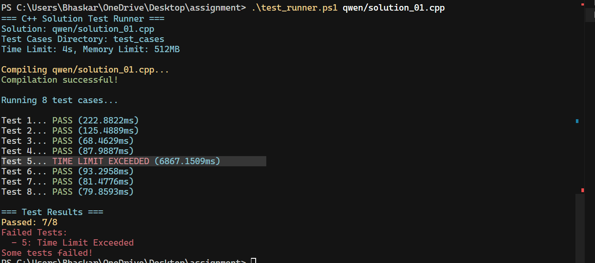
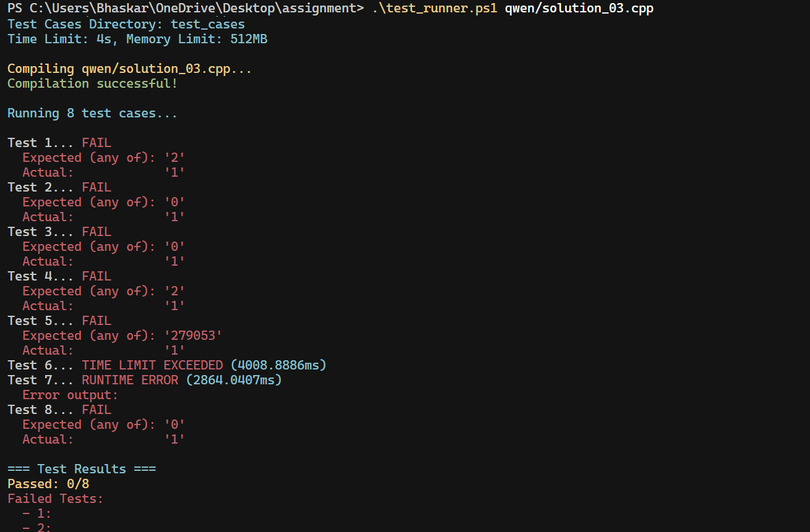
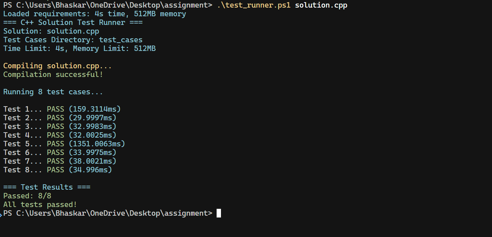

# Qwen Model Conversations

This file contains links to conversations with the Qwen model for solving this problem.

## Attempt 1
- **Solution File**: solution_01.cpp
- **Status**: Failed
- **Conversation Link**: [link](https://chat.qwen.ai/s/57f91a6b-2552-4245-a777-7687bffc4f8c?fev=0.0.219)
- **Notes**: Time limit exceeded

## Attempt 2
- **Solution File**: solution_02.cpp
- **Status**: Failed
- **Conversation Link**: [link](https://chat.qwen.ai/s/6ed00cc8-273e-4802-9cbd-45ec95ff816c?fev=0.0.219)
- **Notes**: All test cases failed

## Attempt 3
- **Solution File**: solution_03.cpp
- **Status**: Failed
- **Conversation Link**: [link](https://chat.qwen.ai/s/1da746b2-0223-4ba6-8bfb-87a307123e9b?fev=0.0.219)
- **Notes**: All test cases failed

And the output for solution.cpp:

## Summary
All three attempts by Qwen failed to solve the problem correctly. The optimal solution can be found in the main solution.cpp file.